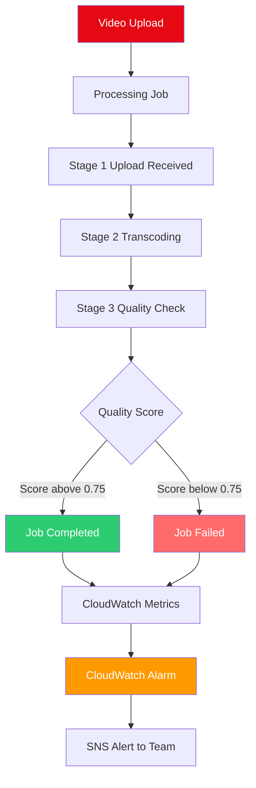
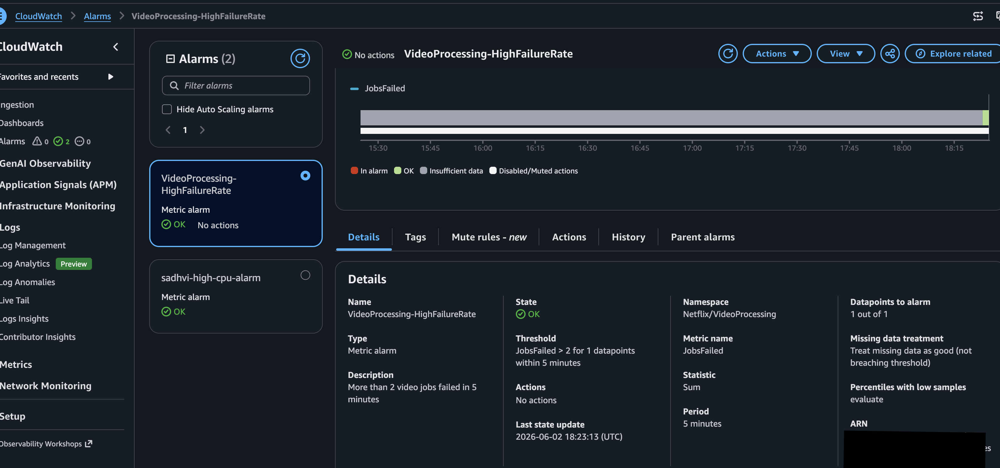
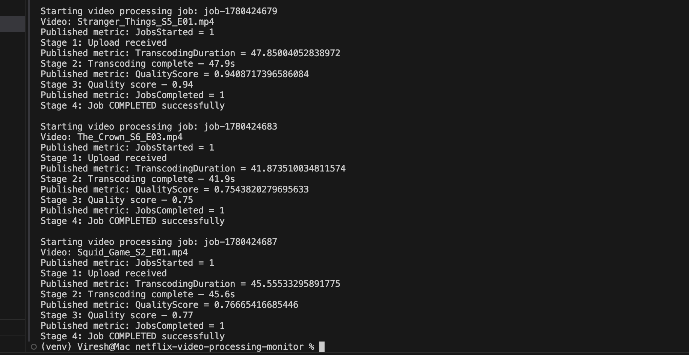
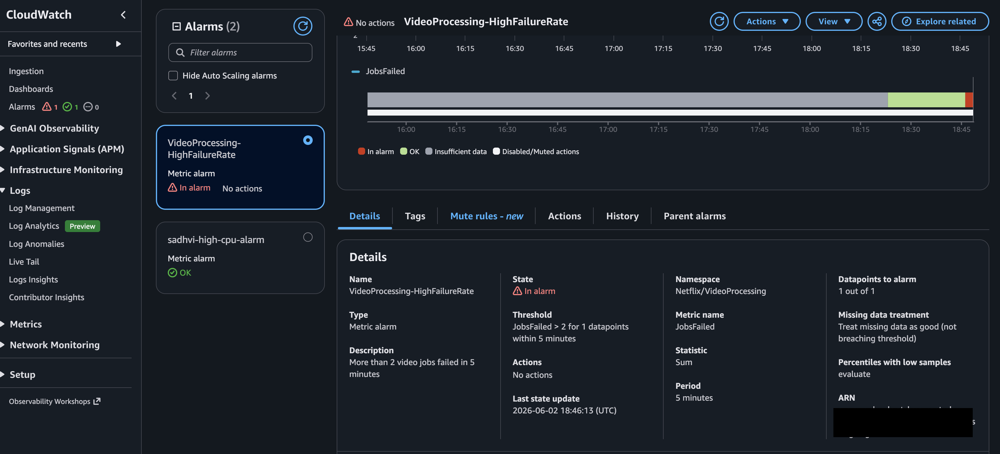

# Netflix Video Processing Monitor

Real-time monitoring system for video processing pipelines built with Python, boto3, and AWS CloudWatch. Tracks transcoding jobs, quality scores, and failure rates with automated alerting.

## The Problem This Solves

Netflix processes thousands of video uploads daily. Each video goes through transcoding, quality checks, and distribution. When jobs fail silently — customers get buffering errors during peak hours.

This system catches failures before customers notice them.

## Architecture



## What It Monitors

| Metric | Description | Threshold |
|---|---|---|
| JobsStarted | Video jobs initiated | Tracked per job |
| JobsCompleted | Successfully processed | Target 95%+ |
| JobsFailed | Failed quality check | Alert if more than 2 in 5 minutes |
| TranscodingDuration | Time per video in seconds | Tracked per job |
| QualityScore | Video quality 0 to 1 | Fail if below 0.75 |

## Real Canadian Use Case

A Canadian streaming platform processes 500 video uploads daily. The DevOps team used to check logs manually every morning — 45 minutes wasted per engineer per day.

This monitoring system alerts automatically within 5 minutes of any failure. Team responds to real problems instead of checking for them.

## Tech Stack

- Python 3 and boto3
- AWS CloudWatch custom metrics and alarms
- AWS SNS for alerting
- Flask REST API for metrics endpoint
- ca-central-1 region for Canadian data residency

## Screenshots

### CloudWatch Alarm — Live on AWS


### Video Processor — Terminal Output


## Setup

```bash
git clone https://github.com/sadvi11/netflix-video-processing-monitor
cd netflix-video-processing-monitor
python3 -m venv venv
source venv/bin/activate
pip install -r requirements.txt
```

Add your AWS credentials to .env file:
## Run

```bash
# Step 1 - Create alarm
python3 monitoring_setup.py

# Step 2 - Send metrics
python3 video_processor.py

# Step 3 - View in AWS Console
# CloudWatch > Metrics > Netflix/VideoProcessing
```

## Nokia Connection

At Nokia I monitored 5G packet processing pipelines handling millions of packets per second. Same principle — measure everything, alert on anomalies, fix before users are affected.

This project applies that same production monitoring mindset to AI and video processing systems.

## Author

Sadhvi Sharma | Cloud Engineer and AI Engineer | Nokia 5G and AWS
AWS Solutions Architect Associate certified
Permanent Resident — available anywhere in Canada immediately
github.com/sadvi11 | linkedin.com/in/sadhvi-sharma-5789a6249

## Screenshots

### CloudWatch Alarm Live on AWS


### Alarm Triggered - Failure Detected


### Video Processor Terminal Output


## Author
Sadhvi Sharma | Cloud Engineer and AI Engineer | Nokia 5G and AWS
AWS Solutions Architect Associate certified
github.com/sadvi11 | linkedin.com/in/sadhvi-sharma-5789a6249
